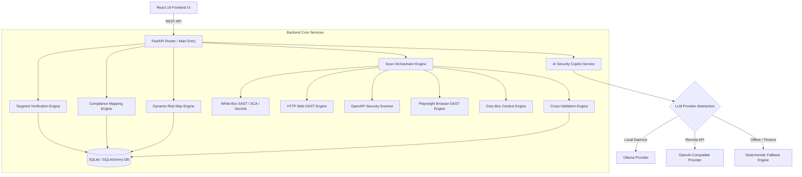
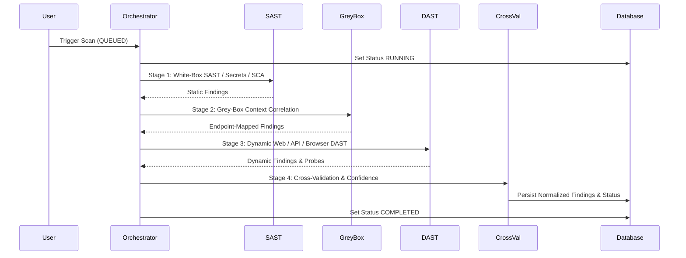

# Kyptic

> **decode. detect. defend.**

Kyptic is an enterprise-grade Application & API Security Platform that unifies white-box code analysis, black-box web & API DAST, browser-based SPA security scanning, grey-box context correlation, targeted vulnerability verification, cross-validation confidence scoring, dynamic risk graph visualization, regulatory compliance mapping, and an AI security copilot.

---

## Key Capabilities

### White-Box Security (SAST & SCA)
- **Static Code Analysis (SAST)**: Identifies code-level injection flaws (SQLi, Command Injection, XSS), cryptographic weaknesses, insecure session handling, and misconfigurations.
- **Hardcoded Secret Detection**: Scans source repositories for exposed API tokens, JWTs, private keys, passwords, and database connection URIs.
- **Software Composition Analysis (SCA)**: Inspects project manifests (`package.json`, `requirements.txt`, `pnpm-lock.yaml`, `Pipfile`) to detect vulnerable third-party dependencies and CVE exposures.
- **Finding Normalization**: Standardizes raw scanner outputs into unified finding models mapped to **CWE**, **OWASP**, and **CVSS v3.1** metrics.

### Web DAST (Dynamic Security Testing)
- **HTTP Crawling & Discovery**: Safely discovers application routes, exposed files (`.env`, `.git`, `backup.zip`), and security headers (`HSTS`, `CSP`, `X-Frame-Options`).
- **SSRF Defenses**: Enforces pre-request IP resolution, loopback (`127.0.0.1`), private RFC-1918 IP blocking, cloud metadata (`169.254.169.254`) blocking, and same-origin redirect constraints.
- **Resource & Concurrency Limits**: Controls timeout bounds (default 5.0s), response size caps (max 100 KB), request payload caps (max 500 KB), and semaphore concurrency.

### API Security
- **OpenAPI / Swagger Ingestion**: Supports OpenAPI 2.0 (Swagger) and OpenAPI 3.x specifications in both JSON and YAML formats.
- **Endpoint Inventory**: Parses API paths, HTTP methods, authentication policies, request schemas, and path/query parameters.
- **Vulnerability Checks**:
  - **BOLA / IDOR**: Identifies endpoints exposing object identifiers without authorization checks.
  - **Broken Authentication**: Detects missing or weak endpoint authentication policies.
  - **Mass Assignment**: Flags endpoints exposing sensitive model property attributes in payload schemas.
  - **Rate Limiting**: Identifies unthrottled API routes vulnerable to resource exhaustion.

### Browser-Based DAST
- **Headless Chromium Automation**: Utilizes Playwright to launch isolated headless browser contexts for dynamic Single Page Application (SPA) crawling.
- **DOM XSS & Client-Side Probing**: Simulates user interactions, form submissions, and JavaScript execution to detect client-side vulnerabilities.
- **Safety Bounds**: Enforces strict timeout controls, memory limits, and same-origin navigation constraints.
- **Graceful Fallback**: Automatically degrades to HTTP-based DAST if Chromium is unavailable without interrupting the scan pipeline.

### Grey-Box Context Engine
- Correlates static source code findings with dynamic API endpoint routes using a 4-tier resolution strategy:
  1. **Exact OpenAPI Path Match**: Matches explicit source routes to ingested OpenAPI paths.
  2. **Explicit Route Annotations**: Resolves code framework routing decorators (`@app.get()`, `@app.post()`).
  3. **Controller Heuristics**: Maps source file paths to controller route definitions.
  4. **Unmapped Fallback**: Preserves unmapped findings while maintaining target tracking.

### Targeted Verification
- Executes active, vulnerability-specific verification probes to eliminate false positives without executing destructive payloads.
- **Dual Execution Modes**:
  - *Verify Existing Finding*: Re-evaluates existing static findings using dynamic HTTP/browser probes.
  - *Standalone Verification*: Executes direct verification probes against specified target endpoints.
- **Supported Vulnerability Categories**: BOLA/IDOR, Broken Auth, Mass Assignment, Rate Limiting, SQL Injection, Command Injection, XSS, CSRF, Path Traversal, CORS Misconfigurations, and Security Headers.

### Cross-Validation & Confidence Engine
- Multi-source evidence correlation engine that aggregates signals across SAST, DAST, SCA, and Targeted Verification.
- Calculates authoritative `confidence_score` ($0-100\%$) and `confidence_level` (`HIGH`, `MEDIUM`, `LOW`).
- Assigns `verification_status` (`CONFIRMED`, `UNVERIFIED`, `INCONCLUSIVE`).
- Preserves manual user triage status (`RESOLVED`, `FALSE_POSITIVE`) across rescan cycles.

### Dynamic Security Risk Map
- Production-grade hierarchical DAG graph visualization mapping application architecture topology:
  $$\text{PROJECT} \longrightarrow \text{API} \longrightarrow \text{ENDPOINT} \longrightarrow \text{FINDING} \longrightarrow \text{VULNERABILITY / FILE}$$
- **Zero Node Truncation**: Displays 100% of discovered endpoints, findings, CWE weaknesses, and source code files.
- **Interactive Canvas**: Supports drag-panning, wheel zooming, **Fit-to-View** viewport auto-scaling, asset tree navigation, and severity filtering.

### Regulatory Compliance Mapping
- Maps Kyptic security findings to control requirements across six major regulatory and standard frameworks:
  - **PCI DSS v4.0** (Payment Card Industry Data Security Standard)
  - **SOC 2 Type II** (Trust Services Criteria)
  - **ISO/IEC 27001:2022** (Information Security Management)
  - **OWASP API Security Top 10 (2023)**
  - **OWASP Web Security Top 10 (2021)**
  - **CWE Top 25** (Common Weakness Enumeration)
- **Evidence-Aware Control Statuses**:
  - `AFFECTED`: Active open findings affect the control.
  - `NOT_AFFECTED`: Sufficient scan assessment completed with no active findings detected.
  - `INSUFFICIENT_EVIDENCE`: Required scan assessment domain has not been completed.
  - `NO_DIRECT_MAPPING`: Control vector lacks direct automated scanner rules.
- *Statutory Disclaimer*: Compliance mapping serves as an evidence-based assessment aid and does NOT constitute legal compliance certification.

### AI Security Copilot
- Backend-driven AI assistant API (`/api/v1/copilot/chat`) providing remediation guidance and advisory code patches.
- **LLM Provider Abstraction**:
  - **Ollama**: Local LLM execution (default: `qwen2.5-coder:1.5b`).
  - **OpenAI-compatible API**: Support for OpenAI models or self-hosted API endpoints.
  - **Deterministic Fallback Engine**: Instantly generates expert security advisories if the LLM provider is offline or times out.
- **Security & Secret Containment**: Automatically redacts API keys, JWTs, bearer tokens, passwords, and private keys before dispatching data to LLM providers. Includes prompt-injection containment boundaries.
- *Note*: RAG (Retrieval-Augmented Generation) is a planned future phase and is not currently implemented.

---

## Architecture



---

## Scan Pipeline

The `ScanOrchestrator` executes automated security scans through a multi-stage pipeline:



### Scan Lifecycle States
- `QUEUED`: Scan request accepted and pending execution.
- `RUNNING`: Active scan stages currently processing target application.
- `COMPLETED`: Scan successfully completed with findings persisted.
- `STOPPED`: Scan cancelled by user.
- `PAUSED`: Scan paused during verification probes.
- `FAILED`: Scan halted due to target unreachable error.

---

## Security Architecture & Controls

Kyptic incorporates defense-in-depth security controls across all scanner and API services:

| Security Control | Implementation Mechanism |
| :--- | :--- |
| **SSRF Protection** | Pre-request IP resolution blocking loopback (`127.0.0.1`), private RFC-1918 IPs, and cloud metadata (`169.254.169.254`). |
| **Redirect Boundaries** | Strict same-origin redirect enforcement (`scheme`, `hostname`, `port`) preventing open-redirect exploitation. |
| **Resource Limits** | Request timeout (5.0s), response body size cap (100 KB), request payload size cap (500 KB). |
| **Concurrency Safeguards** | Thread-safe semaphores limiting concurrent active DAST probes (max 5 concurrent requests). |
| **Zip Slip Defense** | Path-traversal validation inspecting ZIP file extraction targets during archive uploads. |
| **Remote $ref Rejection** | Rejects external HTTP/HTTPS schema references in OpenAPI specs to prevent out-of-band SSRF. |
| **Secret Redaction** | Redacts API keys, JWTs, authorization headers, and passwords prior to logging or sending data to Copilot. |
| **Browser Isolation** | Bounded headless Playwright browser contexts with same-origin policy enforcement. |
| **Prompt Injection Defense** | XML-escaped data boundaries and strict role segregation preventing prompt injection in Copilot. |
| **Read-Only Verification** | Probe logic relies strictly on safe HTTP methods and non-destructive payloads. |

---

## Supported Vulnerability Coverage

| Category | Vulnerability | Detection Method | Verification Engine | Status |
| :--- | :--- | :--- | :--- | :--- |
| **API Security** | Broken Object Level Authorization (BOLA) | OpenAPI / DAST | Targeted Verification Probe | **Implemented** |
| **API Security** | Broken Authentication | OpenAPI / DAST | Targeted Verification Probe | **Implemented** |
| **API Security** | Mass Assignment | OpenAPI / SAST | Targeted Verification Probe | **Implemented** |
| **API Security** | Unrestricted Resource Consumption (Rate Limiting) | OpenAPI / DAST | Targeted Verification Probe | **Implemented** |
| **Injection** | SQL Injection (SQLi) | SAST / DAST | Targeted Verification Probe | **Implemented** |
| **Injection** | Command Injection | SAST / DAST | Targeted Verification Probe | **Implemented** |
| **Injection** | Cross-Site Scripting (XSS) | SAST / Browser DAST | Targeted Verification Probe | **Implemented** |
| **Auth & Session** | Cross-Site Request Forgery (CSRF) | SAST / Web DAST | Targeted Verification Probe | **Implemented** |
| **Access Control** | Path Traversal / Arbitrary File Read | SAST / Web DAST | Targeted Verification Probe | **Implemented** |
| **Configuration** | CORS Misconfiguration | Web DAST | Targeted Verification Probe | **Implemented** |
| **Configuration** | Missing Security Headers | Web DAST | Targeted Verification Probe | **Implemented** |
| **Client-Side** | DOM-Based XSS | Browser DAST | Targeted Verification Probe | **Implemented** |
| **Secrets** | Hardcoded Credentials & API Keys | SAST / Secrets | Cross-Validation Engine | **Implemented** |
| **SCA** | Vulnerable Third-Party Dependencies | SCA Scanner | Cross-Validation Engine | **Implemented** |

---

## Installation & Setup

### Prerequisites
- **Operating System**: Windows 10/11 (or Linux/macOS)
- **Python**: Python 3.10+
- **Node.js**: Node.js 18+ & npm
- **Git**: Latest release
- **Playwright / Chromium**: Required for Browser-Based DAST
- **Ollama** *(Optional)*: Required for local AI Copilot LLM execution

---

### Step 1: Clone Repository

```bash
git clone https://github.com/sakship701/kyptic-api-security.git
cd kyptic-api-security
```

---

### Step 2: Backend Setup

Create and activate a Python virtual environment:

```powershell
python -m venv .venv
.\.venv\Scripts\Activate.ps1
```

Upgrade `pip` and install backend dependencies:

```powershell
python -m pip install --upgrade pip
pip install -r backend/requirements.txt
```

---

### Step 3: Playwright Chromium Setup

Install the headless Chromium browser binary required for Browser DAST:

```powershell
playwright install chromium
```

*Note*: If Chromium is not installed, Kyptic will gracefully log a warning and skip browser DAST without failing scans.

---

### Step 4: Frontend Setup

Navigate to root directory and install npm dependencies:

```powershell
npm install
```

---

### Step 5: Environment Configuration

Copy the example environment file:

```powershell
cp .env.example .env
```

To enable AI Security Copilot with Ollama, ensure Ollama is running locally:

```powershell
ollama pull qwen2.5-coder:1.5b
```

---

## Running Kyptic

### Start Backend API Server

From the root directory, launch the FastAPI server using Uvicorn:

```powershell
python -m uvicorn backend.app.main:app --reload --port 8000
```

- **Backend API**: `http://localhost:8000`
- **Interactive Swagger Docs**: `http://localhost:8000/docs`
- **ReDoc Documentation**: `http://localhost:8000/redoc`

### Start Frontend Development Server

In a second terminal window, launch the Vite dev server:

```powershell
npm run dev
```

- **Frontend UI Application**: `http://localhost:5173`

---

## Running Tests

### Backend Unit & Integration Tests

Run the complete backend test suite using `pytest`:

```powershell
python -m pytest backend/app
```

*Latest Test Results*: **322 passed, 2 skipped** (324 total tests executed in ~4 minutes).

### Frontend Production Build Test

Verify TypeScript compilation and Vite build:

```powershell
npm run build
```

---

## Project Structure

```text
kyptic-api-security/
├── backend/
│   ├── app/
│   │   ├── main.py                  # FastAPI Application Entrypoint
│   │   ├── config.py                # Platform Configuration & Settings
│   │   ├── database.py              # SQLAlchemy DB Connection & Migrations
│   │   ├── models/                  # Database Models (Project, Scan, Finding, ApiEndpoint)
│   │   ├── schemas/                 # Pydantic Schemas (Request/Response Models)
│   │   ├── security/                # Verifiers, Registries & Compliance Definitions
│   │   ├── services/                # Core Business Logic & Security Engines
│   │   ├── routers/                 # FastAPI API Endpoint Controllers
│   │   └── test_*.py                # Automated Test Suite
│   └── requirements.txt             # Backend Python Dependencies
├── src/                             # React 19 Frontend Application
│   ├── api/                         # Frontend API Client Services
│   ├── components/                  # UI Components & Layout Systems
│   ├── context/                     # Global React Context State
│   ├── pages/                       # Application Views (Dashboard, Risk Map, Compliance, etc.)
│   └── App.tsx                      # App Navigation & Router Setup
├── docs/                            # Feature Documentation
├── .env.example                     # Environment Configuration Template
├── package.json                     # Frontend Dependencies & Scripts
└── README.md                        # Project Documentation
```

---

## API Router Documentation

| Router Path | Description | Key Endpoints |
| :--- | :--- | :--- |
| `/api/v1/projects` | Project Management & Onboarding | `POST /`, `GET /`, `POST /{id}/ingest` |
| `/api/v1/scans` | Unified Scan Execution & Status | `POST /`, `GET /{id}`, `POST /{id}/stop` |
| `/api/v1/findings` | Vulnerability Triage & Lifecycle | `GET /`, `PATCH /{id}/status`, `GET /summary` |
| `/api/v1/api-security` | OpenAPI Spec & Endpoint Inventory | `POST /ingest-spec`, `GET /{project_id}/endpoints` |
| `/api/v1/targeted-verification` | Active Verification Engine | `POST /verify-target`, `GET /supported-vulnerabilities` |
| `/api/v1/greybox` | Grey-Box Context Engine | `GET /{project_id}/context-map` |
| `/api/v1/copilot` | AI Security Copilot Router | `POST /chat`, `GET /status` |
| `/api/v1/risk-map` | Dynamic Risk Graph API | `GET /{project_id}` |
| `/api/v1/compliance` | Regulatory Compliance API | `GET /{project_id}?framework=PCI_DSS` |
| `/api/v1/reports` | JSON / HTML / PDF Security Reports | `GET /{project_id}/json`, `GET /{project_id}/pdf` |

---

## Current Project Status

Kyptic has completed all development milestones through **Phase 8**:

- **Phase 1 — Unified Security Scan Orchestration**: Core scan execution pipeline.
- **Phase 2 — Cross-Validation & Confidence**: Multi-source evidence correlation.
- **Phase 3 — Grey-Box Context Engine**: Source-code to OpenAPI route mapping.
- **Phase 4 — Targeted Verification**: Active non-destructive verification probes.
- **Phase 5 — Vulnerability Coverage Expansion**: False-positive hardening across 11 categories.
- **Phase 6 — Browser-Based DAST**: Playwright headless SPA scanning.
- **Phase 7A — AI Security Copilot**: Provider-agnostic LLM integration & offline fallback.
- **Phase 8 — Dynamic Risk Map & Regulatory Compliance**: Scalable DAG topology & 6-framework compliance registry.

*Planned Work*: **Phase 9 (RAG Knowledge Layer)** for local vulnerability documentation retrieval is planned for a future release and is not currently implemented.

---

## Safety Notice & Responsible Use

Kyptic is an application security testing tool designed for defensive security analysis, vulnerability management, and authorized penetration testing.
- Users must obtain explicit authorization before executing DAST or verification probes against target web applications or API endpoints.
- Do not run dynamic probes against unauthorized third-party production infrastructure.

---

## License

No LICENSE file is currently included in this repository. All rights reserved.
